# WeatherSearchWebsite

## Introduction

This project is a webpage that allows users to search for weather information using the *Forecast.io* API and display the 
resule on the same page below the form. The project is deployed on **AWS**.

The user provides the location information such as Street address, City and State for which they
would want to find the detailed weather information or provide their current location.

Once the user has provided the data and clicks on the Search button, **validation** will be donw to check that the entered data is valid. Once the validation is successful, 3 tabs will be displayed, which correspond to Current tab, Hourly tab and Weekly tab. 

The website also supports adding cities to and removing cities from the **Favorites** tab and **sharing** the weather info with Twitter.

## Display and Functionality
### Initial Page
When a user initially opens the webpage, it will look like following:

  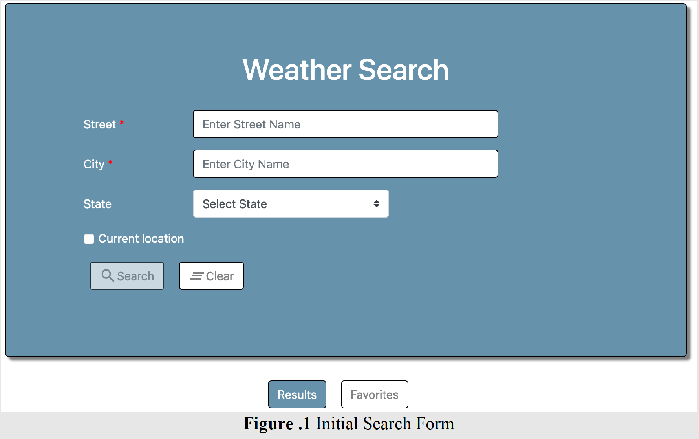

The search form above is by using a *Bootstrap form*, and there are 3 fields in the sesarch form which are required if the Current Location is not checked:

1. Street

2. City: This input field supports **autocomplete**, but the user does not necessarily choose what suggested by the autocomplete. 

3. State: The user can select from the options in the drop-down menu.

  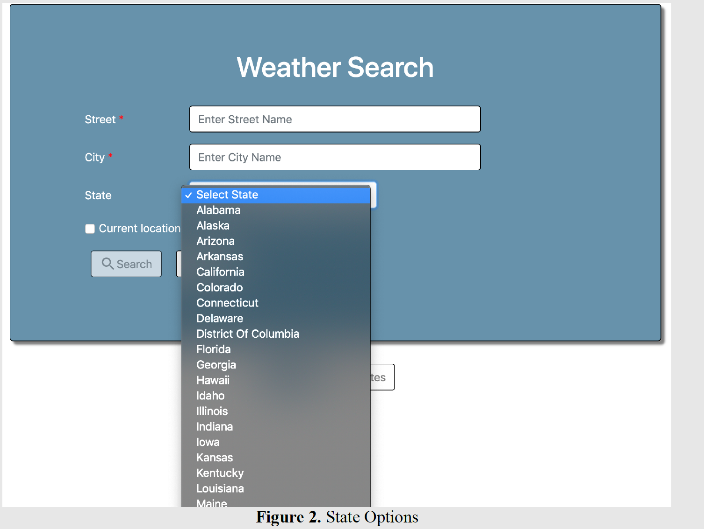

The search form has two buttons:

1. Search: The "Search" button will be **disabled** whenever either of the required fields is empty or validation fails, or the user location is not obtained yet. 

2. Clear: This button reset the form fields and clear all validation errors if present, switch the view to the results tab and clear the result area.

Whenever data is being fetched, a dynamic **progress bar** must be displayed as following, the progress bar is implemented by the *prograss bar* feature of *Bootstrap*. 

  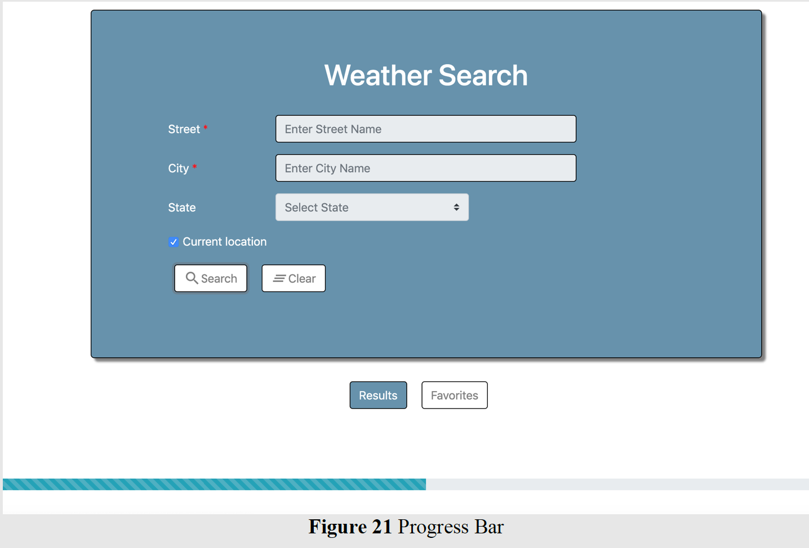

### Validation
Your application will check if the “Street” and “City” edit boxes contain something other than
spaces or blank. If not, then it’s invalid and an error message will be shown as following.

  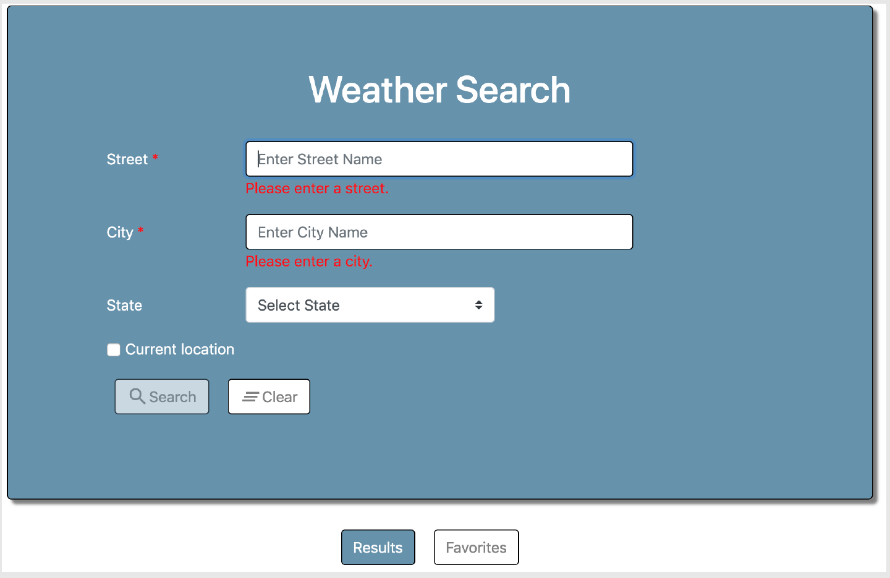

If the Current Location checkbox is checked, then the Street, City and the State controls will be
disabled with their values retained.

If for any reason an error occurs due to location error, an appropriate error message will be displayed.

  

Whenever the search receives no records, an appropriate message will be displayed. 

  

### Result Tab
The results will be displayed below the form as following:

  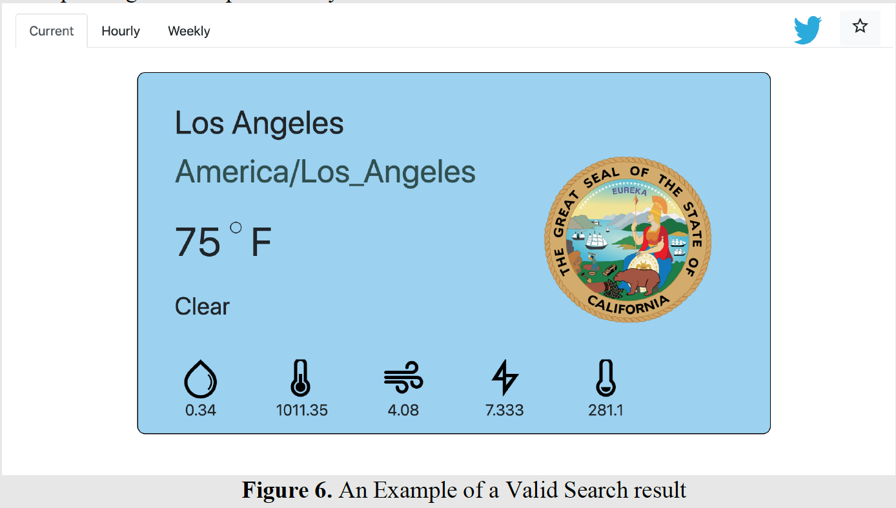

And the results will be displayed in a responsive mode compatible with mobile devices.

### Current Tab
The current tab is a *card layout* which provides the details of the **current weather** fot that day at the corresponding location provided by the user. 

  

On hovering the icons, a **tooltip** will be displayed for that corresponding icon, I used *Angular Material* to implement this. 

  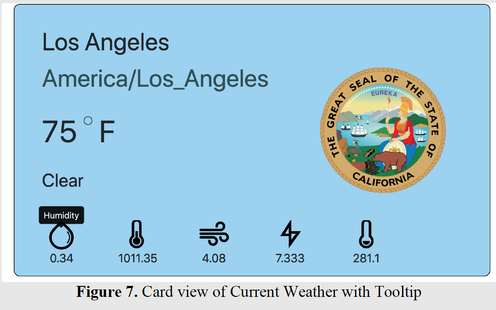

### Hourly Tab
This tab provides a **bar chart** for all the parameters of the weather. There are 6 parameters:

1. Temperature (Fahrenheit) vs Time (Hourly).

2. Pressure (Millibars) vs Time (Hourly).

3. Humidity (%) vs Time (Hourly).

4. Ozone (Dobson Units) vs Time (Hourly).

5. Visibility (Miles) vs Time (Hourly).

6. Wind Speed (Miles per hour) vs Time (Hourly).

  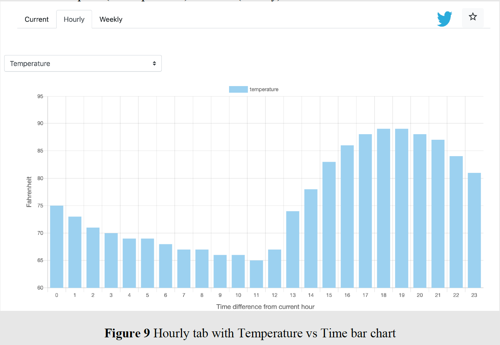

There are 6 charts corresponding to the parameter, which is provided by the dropdown menu.

  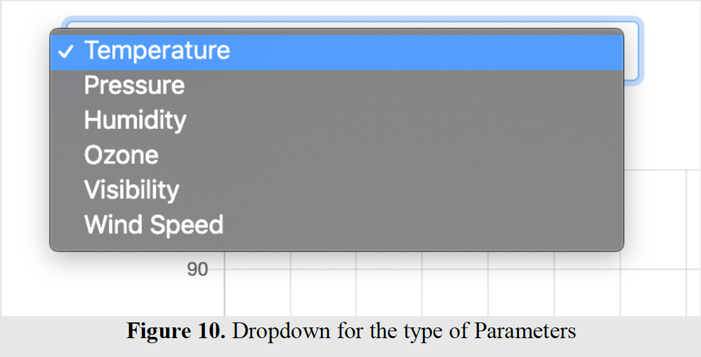

### Weekly Tab
This tab provides a **range bar chart** of the minimum and maximum temperature for the next 7 days in the week.

  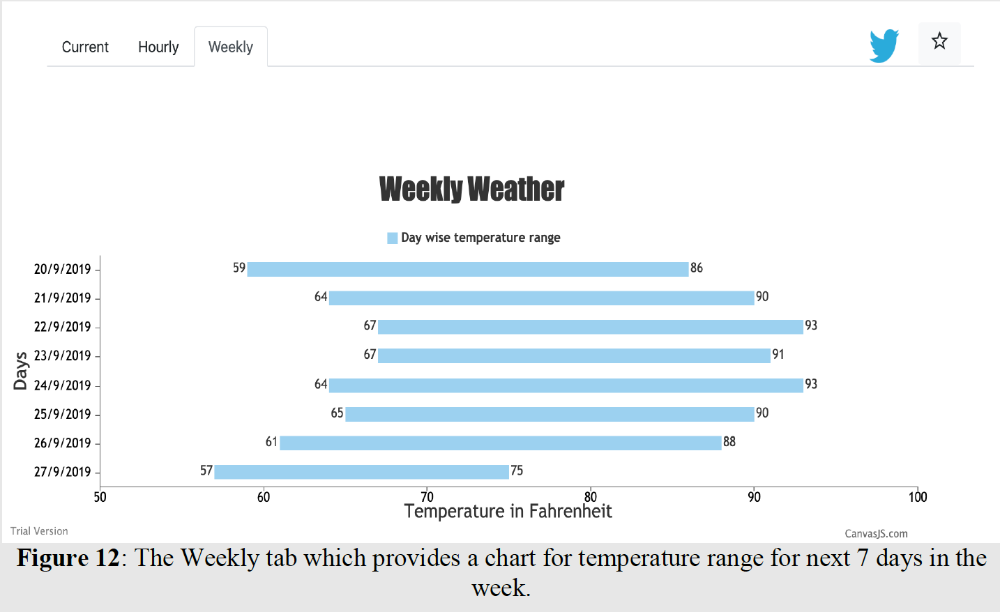

On clicking on any one of the range bar chart rows, a corresponding **modal window** is displayed for that data. The **modal window** provides the detailed weather  information for that date.

  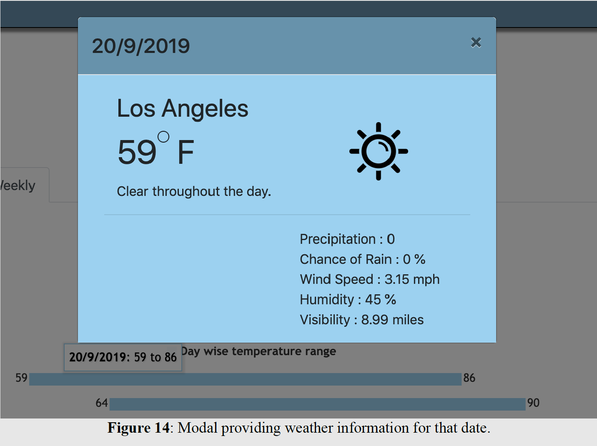

### Favorite Tab

The **Favorite** button (star) provides the user the ability to **add** or **remove** the city to their favorites tab. 

The favorites button should be **disabled** until the content of the event tab and venue tab are available.

In the **Favorite Tab**, the favorite cities are listed in a *table* format. The user can search for weather information for that city by clicking on the City name in the "City" column. 

The information displayed in the Favorites tab is saved in and loaded from the *local storage* of the browser, the buttons in the Favorites column of the Favorite Tab is only used to **remove** a city from the list and has a "trash" icon for it to be removed from the Favorite. 

The columns in this tab are:

1. Counter: A counter value indicating the number of cities in the favorites list.

2. Image: The state seal provided by the *Google Custom search API*.

3. City: The favorite city the user put in their favorites list. On clicking it will provide the
weather details for that city.

4. State: The State abbreviations.

  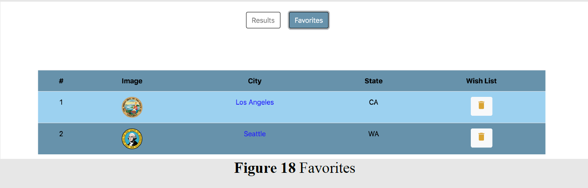

If a user closes and re-opens the browser, its Favorites will still be there. 

### Twitter Button

The **Twitter** button allows the user to compose a Tweet and post it to Twitter. Once the button is clicked, a new *dialog* will be opened and display the default Tweet content in the fommat as following:

  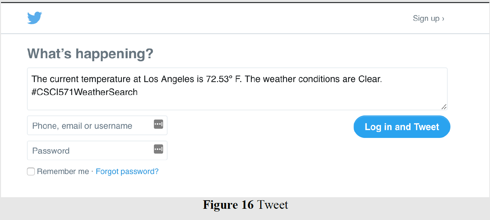

### Responsive Design
When opened on a mobile device, the webpage will be displayed responsively according to the size of the screen. The following are snapshots of the webpage opened with Safari on iPhone 7 Plus. 

  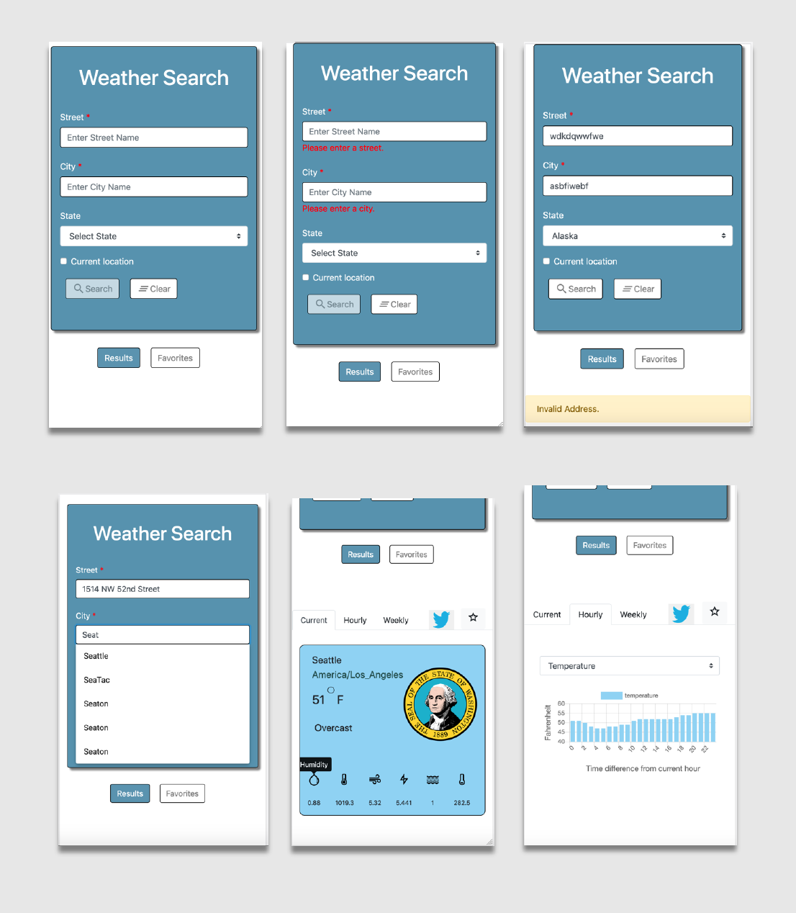

## API Documentation

### Google geocode API
Google geocode API is for getting the *latitude* and *longitude* of a specific location, such as a city. 

The Google geocode API call looks like: https://maps.googleapis.com/maps/api/geocode/json?address=[STREET, CITY,
STATE]&key=[YOUR_API_KEY], and I used **JSON request** to get the *latitude* and *longitude* from the Google geocode API.

### DarkSky API
Once the latitude and longitude are fetched from the Google geocode API, it has to be passed to the DarkSky API to fetch the weather details.

The DarkSky API is documented here:

https://darksky.net/dev/docs

An example of an HTTP request to the DarkSky API that searches for the weather information from the user’s current location or the location provided by the user is shown below:

https://api.darksky.net/forecast/[key]/[latitude],[longitude]
